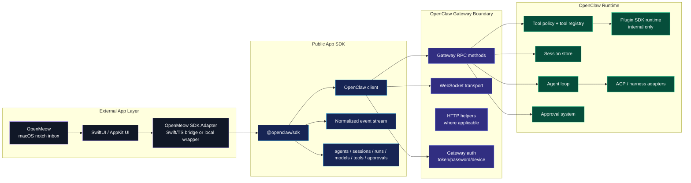
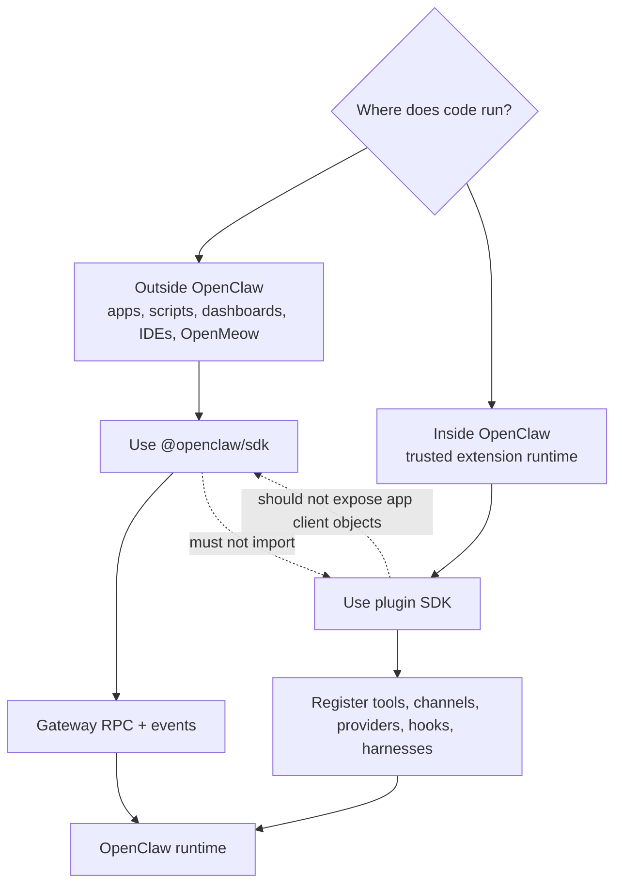
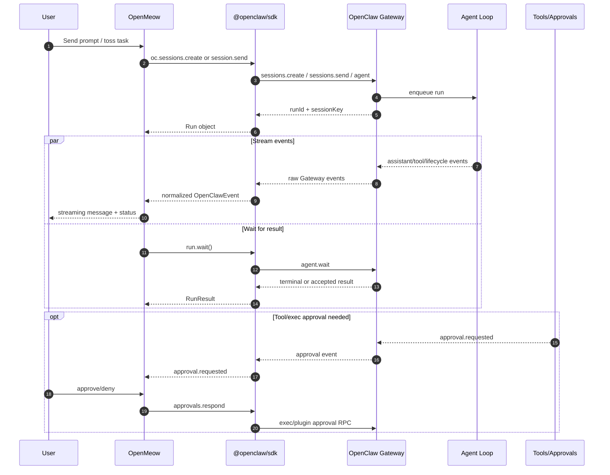
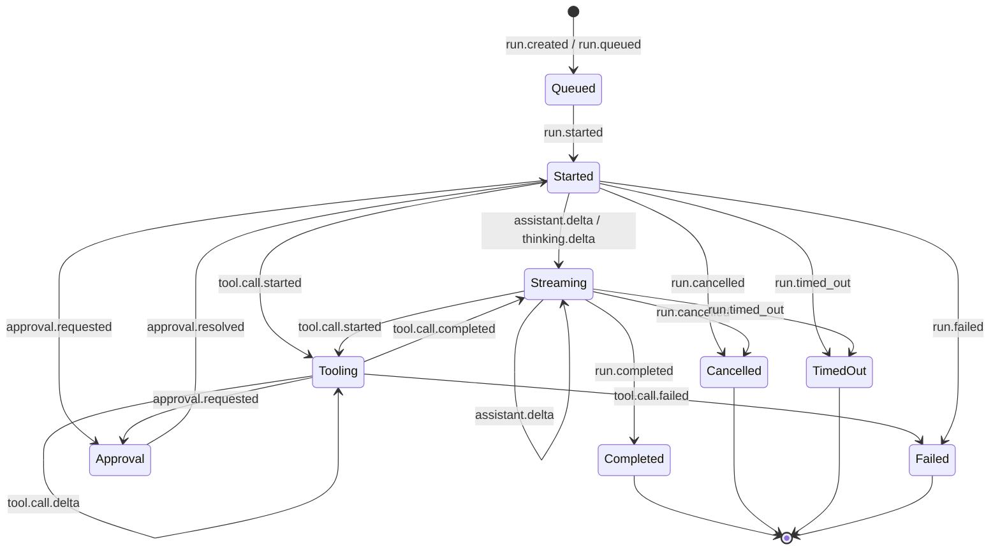
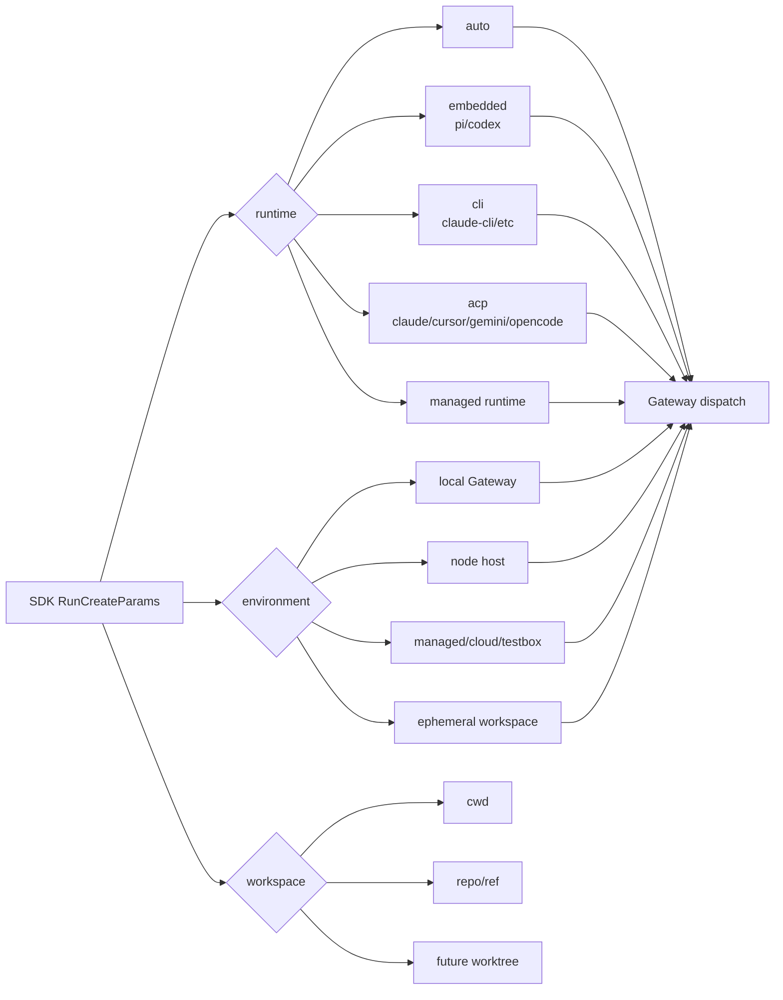
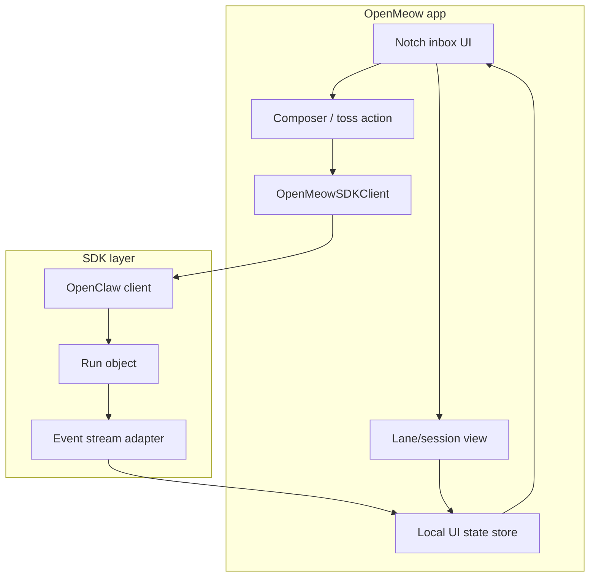

# OpenMeow + OpenClaw SDK Architecture

## Review thesis

The OpenClaw SDK should become the **external app/client facade** for OpenClaw. OpenMeow should dogfood it first because OpenMeow is exactly the kind of app the SDK exists for: a real UI that needs agents, sessions, streaming, cancellation, approvals, tools, and eventually artifacts.

The key boundary is:

> OpenMeow should call `@openclaw/sdk`, and `@openclaw/sdk` should call OpenClaw Gateway RPCs. OpenMeow should not depend on OpenClaw internals, plugin runtime APIs, or shell commands.

## 1. System boundary

## 2. SDK vs Plugin SDK

**Rule:** OpenMeow belongs on the left side. Desktop-use, channels, providers, and tool registrations belong on the right side.

## 3. OpenMeow run lifecycle

## 4. Event normalization contract

OpenMeow should build UI state from normalized events, not provider-native raw events. Raw events remain available for debugging.

## 5. Runtime and environment direction

Current SDK can discover environments read-only through `environments.list/status`, but run-level runtime/environment/workspace selection and provisioning should still reject unsupported fields explicitly rather than silently ignoring them.

## 6. OpenMeow module cut

OpenMeow should keep local UI conversation state distinct from OpenClaw runtime session state. The SDK adapter maps between them.

## 7. Public contract principles

1. **Gateway is the protocol boundary.** Apps should not import OpenClaw internals.
2. **SDK should be boring and stable.** High-level nouns should not leak implementation-specific runtime details.
3. **Normalized events are product-critical.** UI apps need stable event names and status semantics.
4. **Unsupported future nouns should throw loudly.** No silent fallback for runtime/environment/artifact/task APIs.
5. **Plugin SDK stays separate.** It extends OpenClaw from inside; it is not the app client SDK.
