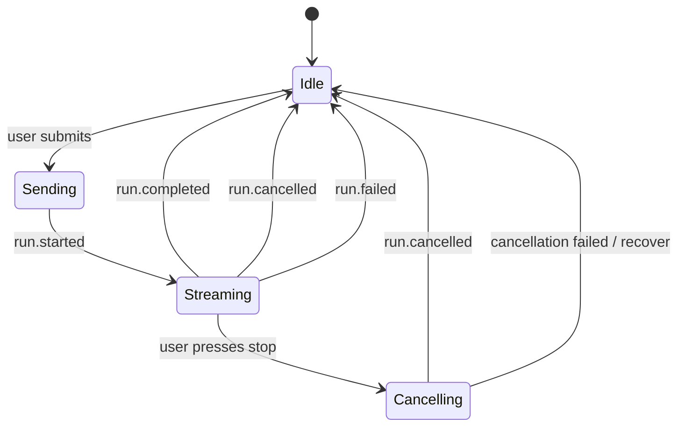

# OpenMeow SDK Dogfood Plan

## Goal

Use OpenMeow as the first serious consumer of `@openclaw/sdk`, proving that the SDK is good enough for an actual app UI and exposing missing Gateway RPCs early.

## Non-goals

- Do not change OpenClaw core inside this repo.
- Do not make OpenMeow call plugin SDK APIs directly.
- Do not bypass Gateway with shell commands for agent/session work.
- Do not require cloud or managed environments for the first path.

## Phase 1 — thin adapter

Create an OpenMeow-side SDK adapter with a tiny surface:

```ts
connect()
listAgents()
createLaneSession(agentId, label)
send(sessionKey, message)
streamRun(runId)
wait(runId)
cancel(runId, sessionKey)
```

Swift can call this through the existing preferred bridge strategy, or the shape can be mirrored in Swift against Gateway until a native SDK exists.

## Phase 2 — UI event model

Map normalized SDK events into OpenMeow UI state:

| SDK event | OpenMeow UI behavior |
|---|---|
| `run.started` | Show active run indicator. |
| `assistant.delta` | Append into streaming placeholder. |
| `assistant.message` | Finalize/replace assistant bubble. |
| `tool.call.started` | Show compact tool activity. |
| `tool.call.delta` | Update tool activity text/log preview. |
| `tool.call.completed` | Collapse or mark tool activity done. |
| `approval.requested` | Show approval card. |
| `run.completed` | Stop spinner, enable send. |
| `run.cancelled` | Mark run stopped. |
| `run.timed_out` | Mark timeout with retry affordance. |
| `run.failed` | Show recoverable error state. |

Local implementation note: `reduceOpenMeowUIState()` now demonstrates this mapping in code by accumulating assistant drafts/final messages, compact tool activity, approval cards, terminal composer state, and debug-only raw events.

## Phase 3 — stop/cancel semantics

OpenMeow composer should show **send or stop, never both**.



## Phase 4 — capability UI

Use SDK discovery to show what each lane can do:

- `agents.list`
- `agent.identity.get`
- `tools.effective`
- `models.list`
- `models.authStatus`

This lets OpenMeow present Kitty/Cody/Nova-style lanes from Gateway state instead of hardcoded assumptions.

## Phase 5 — gap-driven upstream feedback

Capture SDK friction as issues/notes:

1. Missing Gateway RPC.
2. Event normalization ambiguity.
3. Wait/cancel mismatch.
4. Auth/discovery pain.
5. Swift/native app bridge pain.

Each finding should include a small repro or desired SDK call.
